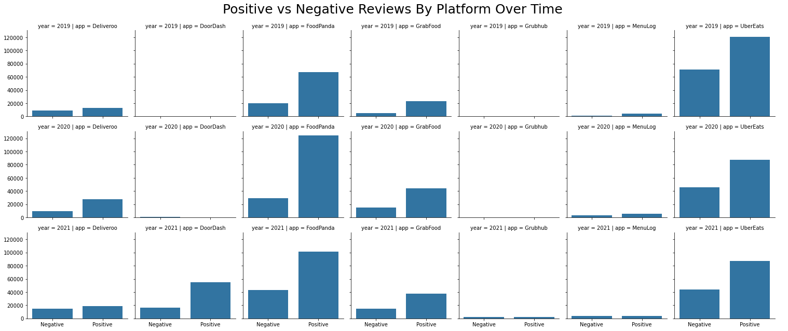
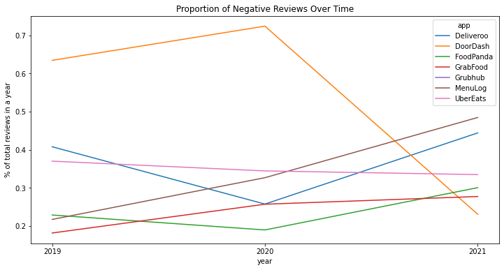
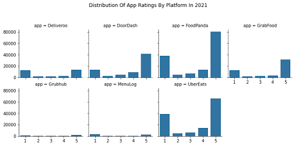
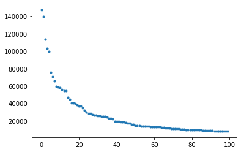
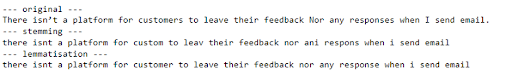
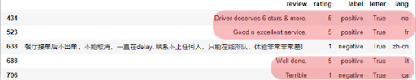
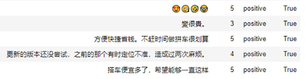

January 22, 2022

<dl>
<dt>Authors</dt>
<dd>Mel Nguyen</dd>
<dd>Bojia Liu</dd>
<dd>Stanley Hung</dd>
<dt>Source Code</dt>
<dd><a href='https://github.com/mads-app-reviews-nlp/app-reviews-nlp'>https://github.com/mads-app-reviews-nlp/app-reviews-nlp</a></dd>
</dl>

# 1. Background
Food delivery apps have become an integral part of many people’s daily lives. From the perspective of food delivery companies, understanding and catering to the needs of millions are no easy feat. At the same time, the food delivery business is extremely competitive, making the task to understand and measure a customer’s “happiness meter” to the platform is even more imminent. In this project, we would like to leverage the power of natural language processing to achieve two goals. Firstly, how do customers feel about various food delivery platforms, and do these sentiments vary over time and locations? And secondly, what are the primary topics that customers write about on these reviews? Getting a low rating says very little about why that customer is deciding to give that rating, rather, we need to understand and mine the pain points that are driving the customers’ decisions. And by understanding them, we can have a more insightful view of the strengths of different food delivery platforms, while also potentially identifying the pain points of each.

# 2. Data Sources
Our focus will be on food delivery platforms in Singapore & Australia. In each country, our team has curated a list of 3 to 4 food delivery apps, namely:
- Australia: DoorDash, UberEats, Grub, Deliveroo, and Menulog
- Singapore: foodpanda, Grab, Deliveroo
For each country, the dataset is constructed from the iOS and Android app stores for each respective country, and for the purpose of the milestone project, the ground truth labels will be based on customers’ ratings. **In other words, customers whose ratings are high (above 3 stars) will be considered positive reviews, and vice versa reviews that are 1 or 2 stars will be considered negative.** Below is an example of a customer review:

We use the `google_play_scraper` library to scrape the reviews from Google Store, and `app_store_scraper` to scrape the reviews from Apple Store. Both libraries allow specifying a country parameter to access the corresponding country’s app store. However, in the raw data, we observe some duplicates for apps that are present in both countries (eg. Deliveroo operates in both Singapore and Australia). The impact is negligible, as the duplicates made up for less than 5% of the total reviews. The scraped reviews are then saved directly into pandas dataframe, which we subsequently separate into 2 Pickle (.pkl) dataset files, one for each country. Each dataset is comprised of the following information: when a review is made, the app/platform, rating, and the content of the review.
In total, there are 659k reviews for Singapore, spanning from November 2013 to December 2021. Similarly, there are 626k reviews for Australia, spanning from September 2009 to December 2021.

# 3. The Landscape Of Reviews
Australia and Singapore are both relatively matured markets when it comes to food delivery platforms. Starting with just 1-2 players, both countries have seen massive growth in the need to order food and even groceries. The appearance of COVID-19 and subsequently nationwide lockdowns have spurred this growth even further, with food delivery being almost the sole alternative to dining out. 

Foodpanda and UberEats are both well-established market leaders. Indeed, Foodpanda is one of the first food delivery services to operate in Singapore, while UberEats is one of the first in Australia. In the last 3 years, Singapore has seen an aggressive expansion of GrabFood, as well as Deliveroo. On the other hand, DoorDash, Grubhub, and Menulog have entered the Australian market, albeit much more recently -- GrubHub, for instance, only started in August 2021. Let us take a look at the breakdown of positive and negative over time of each app. 

As soon as the reviews are broken down into positive and negative, we can see a few emerging patterns amongst the food delivery platforms. Notably, Foodpanda’s number of positive reviews grew significantly between 2019 and 2020, but reduced between 2020 and 2021, replaced instead by more significant growth in negative reviews. UberEats, in contrast, saw a reduction in both positive and negative reviews over the same period. While this may not be a conclusive insight into the general popularity of each of these delivery platforms, it does show that the landscape of food reviews is by no means static -- instead, it is constantly changing as each food delivery platform develops new features or encounters new setbacks, as well as a shift in the general consumer appetite for food delivery as a whole. It’s also worth pointing out that an app’s time in the market is not a guarantee of an upward trend in positive reviews, as shown by both Foodpanda and UberEats above.
That brings us to the next point, which is, how has the general sentiment for each app changed over the years? To answer this question, we will look into the proportion of negative reviews for these platforms over time:

It is much clearer to see a sharp drop in the proportion of negative reviews for DoorDash, which is due to a significant increase in the volume of reviews, especially positive reviews in 2021. UberEats, interestingly, has seen the proportion of negative reviews trending down, as the overall volume of reviews decreases. Deliveroo and Foodpanda both saw an initial dip between 2019 and 2020 but subsequently rose back up in 2021, even exceeding 2019 levels. A product or customer experience team could further deep dive into this by analyzing the changes that were rolled out to the app during this period, potentially coupling with the topic modeling results that would be covered in subsequent sections. Last but not least, we will take a more granular look into each platform’s rating distribution in 2021.

Perhaps unsurprisingly, we see a highly polarized distribution of ratings, with reviews being either a 1 (worst) or a 5 (best). This could be due to the fact that users who are neither very unsatisfied nor very satisfied with an app would be less likely to write reviews than users who would take to the app store to write a complaint, or to express a very positive opinion about an app. 

# 4. Sentiment Classification 
Sentiment classification is the most appropriate supervised learning task for our reviews dataset. The applications of sentiment classification include, but are not limited to social network monitoring, estimating NPS (Net Promoter Score) score, evaluating product feedback, and streamlining customer support processes.  
Our sentiment classification uses the reviews dataset documented above. We train 2 separate sets of models - one for Singapore and one for Australia, as each market could have its own nuances that should be captured separately. For each market, our dataset is divided into train and validation sets accordingly.
## Naive Bayes & Logistic Regression
Both Naive Bayes and Logistic Regression are widely used, fast to compute, and simple to tune supervised learning algorithms, and hence they are ideal candidates as baseline models for our classification task. On the feature engineering side, both Bag Of Words and Word Embeddings methods are used to represent our dataset.
### Bag Of Words (BoW)
A bag of words is constructed by first tokenizing the text data, and for this exercise, we first whitespace-split the sentences, then apply a regex to extract only alphanumeric tokens. This is, however, not the only way to tokenize a sentence. There could be more advanced methods, such as lemmatization, that could be applied to our dataset, but for the purpose of having a baseline model, we choose to keep the tokenization process relatively simple. Regardless of our approach, it is clear that the distribution of token frequencies follows Zipf’s law:

This has two important implications. Firstly, we can remove tokens many tokens that do not appear frequently, as they most likely would not impact predictive performance. Secondly, common tokens are most likely stopwords and should be removed as well. 
With this, we created a TF-IDF vectorizer that excludes English stopwords and has a minimum frequency of 500. We also include bigrams and unigrams into our vectorizer.

Once the vectorizer is ready and the train dataset is transformed, we started training our Naive Bayes and Logistic Regression classifiers. The baseline results are shown below. Note that we have also run a few dummy classifiers (Uniform & Most Common), and confirmed that these algorithms outperformed these dummy classifiers.

| Algorithm                | Macro F1-Score | Accuracy |
| ----------------------   | -----------    | ----------- |
| MultinomialNB            | 0.85           | 0.88        |
| BernoulliNB              | 0.79           | 0.85        |
| ComplementNB             | 0.83           | 0.86        |
| Logistic Regression      | 0.85           | 0.87        |

The baseline results are quite promising, with both MultinomialNB and Logistic Regression achieving 0.85 on macro F1-score. This means that the bag-of-word approach is a rather solid approach for sentiment classification. It's also interesting to see that while MultinomialNB has a rather balanced number of false positives and false negatives, BernoulliNB and ComplementNB are different. BernoulliNB has a much higher number of false positives, while ComplementNB has a much higher number of false negatives.  
#### Fine-tuning
For the BOW approach, fine-tuning the TF-IDF vectorizer could potentially improve the model performance. The table below summarizes various approaches to fine-tune the TF-IDF vectorizer on our best performing algorithm (Logistic Regression):

| Approach                                                     | Impact On Logistic Regression F1-score | 
| ------------------------------------------------------------ | -------------------------------------- | 
| Reduce min_df to 100                                         | Accuracy improved to 0.89 while F1 stays the same. Increased training time.       | 
| Skip stopwords removal                                       | Accuracy improved to 0.9, and F1 improved to 0.88      | 
| Set max_df to 5000                                           | No change in performance        | 
| Clip token frequency at 1 (using the `binary` parameter)     | No change in performance      | 

Interestingly, omitting the stopwords removal step has resulted in the best performance improvement among other approaches. Reducing min_df in other to capture more tokens in the corpus also led to a bump in performance, but this is at the expense of a significantly longer training time.  
With the TF-IDF tuning results, we also use this as the foundation to tune the `C` parameter for logistic regression by performing a grid search over a range of C parameter values. The result, however, does not show a significant performance improvement with the tuned C parameter, suggesting that for this combination of feature engineering and supervised learning algorithms, tuning at the feature engineering stage would have a bigger impact on the final performance.

### Word Embeddings
This section explores the use of word embeddings as feature extraction. We'll be working with dense representations of documents instead of the bag-of-words representations used earlier. To do this, we'll use the average (or mean) word vector of a document and classify from those representations. As a first step, we tokenize the reviews using the same regex logic. However, since we're going to be computing an average word vector, we remove stop words. Here, we'll use NLTK's list of English stop words. Since these words shouldn't affect our classification decision, we can remove them to avoid adding any noise they might cause. 
Our word vectors are constructed using 4 different corpora - our entire text reviews corpus, as well as gensim’s pre-trained corpora, namely `wordvec-google-news-300`, `glove100`, and `glove300`. The table below documents the performance result of each corpus when generating word embeddings and training them with Logistic Regression:

| Corpus                   | Macro F1-Score | Accuracy |
| ----------------------   | -----------    | ----------- |
| Text Reviews Dataset     | 0.87           | 0.86        |
| Google News 300          | 0.86           | 0.85        |
| Glove 100                | 0.80           | 0.79        |
| Glove 300                | 0.82           | 0.81        |

The performance overall is slightly underperforming as compared to BOW approach, but it is interesting to see that gensim’s corpora perform almost just as well as using our dataset, especially the google-news-300 corpus. Having these texts represented as word vectors can also be useful for many other cases, including but not limited to topic modeling and document similarity. The promising performance on gensim’s out-of-the-box corpus also means that companies who would like to set up NLP models without having access to a lot of training data can potentially leverage this approach.

## SVM & Decision Trees, RandomForest
Support Vector Machine (SVM), and Random Forest are both simple supervised machine algorithms used for text classification purposes. In this section, we use these algorithms as well as the Decision Tree algorithm.
In the previous section, we focus on how performances vary when adapting different techniques - BoW and word embeddings. The focus of this section is to apply multiple ways of text pre-processing and compare the performance across methods and models. Only word embeddings with TD-IDF are used for this purpose.
**Overall process**  
Pre-process review data with following methods respectively:
- Word lemmatization
- Stopwords removal
- Language detection
After which, splitting train, test datasets, vectorizing each dataset. Add columns to vectorized data as an additional feature when necessary, then fit each model with training data. Lastly, compare the F1-score of each model in different scenarios.  
**Baseline scenario**  
Feed vectorized training data directly to each model without any pre-processing.
**Word Lemmatization**  
To reduce some noises caused by word forms, we want to group the inflected forms as a single word. The common way to do it is stemming and lemmatization. Both ways are tried out before we decide to use lemmatization. Examples shown below:

We can see that lemmatization gives more information on the context of words while stemming has some words truncated into incomplete syllables that do not even make sense. Thus we adopt the lemmatization method using NLTK building lemmatizer.  
**Stopwords removal**  
Using NLTK’s list of English stopwords.  
**Language detection**  
To filter out non-English reviews, language detection is used. In the previous section, it is done by SpaCy’s lang-detect module. The problem with that is it takes a long time to run and has an unsatisfying detection result. For instance:

The detector mistakenly classifies some English reviews as other languages, thereby filtering out more reviews than it should have. To solve this issue, an alternative way of filtering out non-English words is used. In the UTF-8 encoding scheme (same for ASCII and other schemes), each character has a UTF-8 sequence number. All English alphabetic, digits and common punctuations, space, lie in a continuous range in the sequence. Knowing that range, filtering out non-English characters (like ‘è’) can be simply achieved by iterating through all characters in each string of review and comparing each character with the beginning and ending character of this range. If any character out of this range is detected, that review is taken as a non-English review.  
The optimized language detector works fine, and the runtime has been drastically reduced. The non-English result is shown below:

**Feature Addition**
So far we have only been using vectors from TF-IDF as features. To investigate if additional features will boost the performance, a new API is introduced. TextBlob is a Python library for processing textual data, which provides a simple API for diving into common natural language processing tasks such as sentiment analysis, classification, and more. We use the polarity API under the sentiment module. Polarity ranges from (-1,1). If polarity is >0, it is considered positive, <0 -is considered negative and ==0 is considered neutral.   
This polarity method alone has ~70% accuracy. We now use the polarity as one feature and concatenate that onto the TD-IDF vectorizer results.  
**Model Performance and Discussion**  
F1 score for each model in each scenario are shown below.

The comparison indicates that lemmatization has basically no impact on model performance. Non-English review removal (i.e. language detection) barely increases the performance. As discussed before, it could be that non-English reviews have largely been removed already when we set min_df in the TF-IDF vectorizer to 500.  
Adding features to original feature vectors does boost the performance. However, one interesting finding is that removing stopwords has lowered the F1 score for Random Forest and SVC. See failure analysis for further discussion.

# 5. Topic Modelling

# 6. Discussion and Next Steps
- For supervised learning, feature engineering is important to achieve high performance. Our project shows that with a robust feature engineering process, we can achieve relatively high baseline performance.
- Having good ground truth labels can be challenging, but is fundamental to a good classification task. As we can see in our failure analysis, many misclassifications happened because the customer ratings themselves are not good ground truth labels.
- There exists a tradeoff between training time and model performance. Deep learning approaches have proven to result in better performance with less data thanks to the power of transfer learning but come at the cost of longer training time and more computational resources (GPU). This is an important consideration that should be evaluated for every NLP pipeline. 
- The most challenging part of unsupervised learning is that there is no subjective measure to tell us how good the model is. It heavily relies on human judgment. The failure of using log-likelihood and perplexity to measure the model performance was a surprise for us because these metrics are perceived as the most popular evaluation metrics.
- The topics extracted from the model look reasonable to us but there is still room for improvement. If time/resources are allowed, we would like to explore the gensim package which is a more robust NLP package than scikit-learn. In addition, the LDA2vec model may be able to help us to tackle the issue around reviewers using different words to represent the same meanings. The LDA2vec model leverages the power of word2vec as the feature representation approach.
- In terms of potential ethical issues, one possible issue that might arise is if we choose to adopt language detection as part of our feature processing. By filtering non-English reviews, we could be training models that are more biased towards English speakers. This is especially apparent for food delivery platforms that operate in countries where there are non-English speakers (e.g Malaysia). 
- Another ethical consideration for deploying these models would be the process of collecting and storing reviews data. Reviews data on both Google App Store and Apple Store could contain personal information such as a person’s name and email address, and if these datasets are not stored and processed properly (e.g drop PII columns or restrict access), there could be a risk of exposing sensitive data.

# 7. Statement Of Work
This project is a collaborative effort with equal participation from everyone, specifically:
- Mel: Supervised Learning (Naive Bayes & Regression), Deep Learning, Final Report
- Bojia: Supervised Learning (SVM & Decision Trees), Final Report
- Stanley: Unsupervised Learning (LDA & NMF), Final Report

